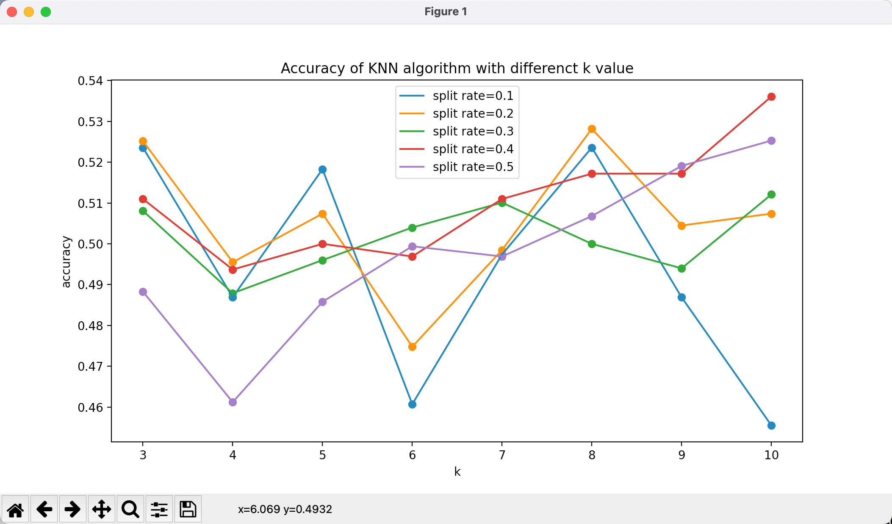
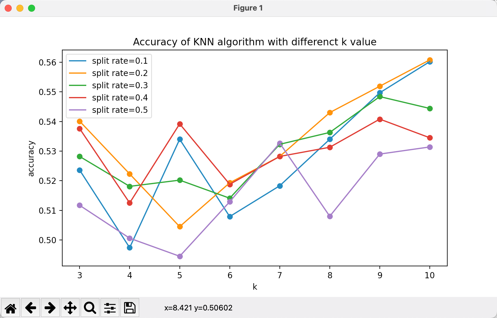
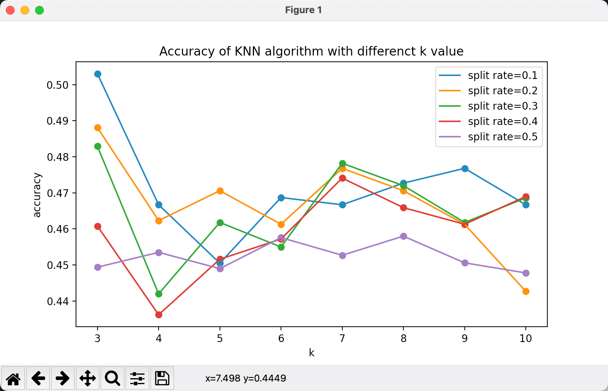
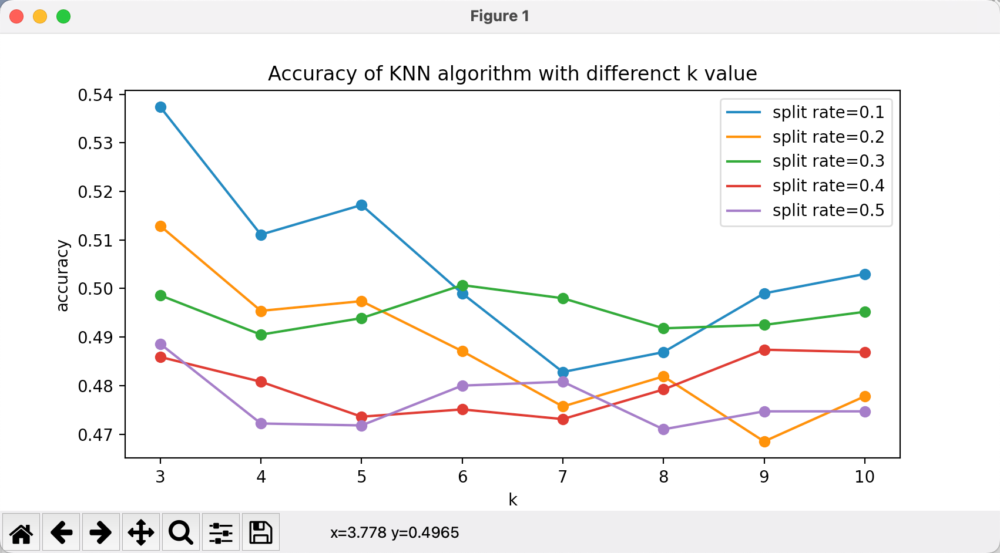

# K-NN Report
郑源泽 19307130077
## 1.任务描述
编写KNN算法对红酒数据集进行分类，**判断红酒的质量等级**。输入为某种酒的各项参数指标，输出为该酒的评分。
## 2.数据集描述
本次实验采用了 kaggle 上的Wine Quality Dataset 。数据来自于葡萄牙北部的红色及白色 Vinho Verde 葡萄酒样本。
数据集中包含了 6497 份葡萄酒数据，共有两类标签：white 和 red，每条数据对应了 12 个特征。整个数据集以 csv 文件格式存储。

## 3.方法介绍
### 3.1数据预处理
- 简单将iris 的数据进行导入并将data 和target 分别存储，利用了data 中的全部 feature 以增加预测的准确性
- 使用简单交叉验证的方式对数据进行分组处理，一部分用于训练，一部分用于测试。分组比例默认为训练:测试=0.8:0.2
```python
def data_split(data, label, split_rate=0.2):
    """split the data according to the split rate

    Args:
        data (list): the raw dataset, it should be list or numpy.array
        label (type): the raw label dataset, it should be list or numpy.array
        split_rate (float, optional):  Defaults to 0.2.

    Returns:
        [train_data, test_data, train_label, test_label]
    """
    random.seed(2022)
    random.random()
    train_data, test_data, train_label, test_label = [[], [], [], []]
    for i in range(len(data)):
        if random.random() < split_rate:
            test_data.append(data[i])
            test_label.append(label[i])
        else:
            train_data.append(data[i])
            train_label.append(label[i])
    return train_data, train_label, test_data, test_label
```
### 3.2算法描述
KNN(K-Nearest Neighbor)是最简单的机器学习算法之一，可以用于分类和回归，是一种监督学习算法。它的思路是这样: 如果一个样本在特征空间中的K个最相似(即特征空间中最邻近)的样本中的大多数属于某一个类别，则该样本也属于这个类别。也就是说，该方法在定类决策上只依据最邻近的一个或者几个样本的类别来决定待分样本所属的类别。
KNN 算法实际上是一种识记类算法，在训练过程中基本没有算法参与，只有存储训练样本。KNN算法将所有训练样本的输入和输出标签 (label) 都存储起来。测试过程中，计算测试样本与每个训练样本的距离，选取与测试样本距离最近的前 k 个训练样本。然后对着 k 个训练样本的 label 进行投票，票数最多的那一类别即为测试样本所归类。

### 3.3算法实现
在 KNN 算法中，距离函数的选取十分重要。常用的有欧氏距离，曼哈顿距离，汉明距离等。
- 欧氏距离实现
  
  ```python
  @staticmethod
  def get_euclidean_distance(point_1, point_2):
    p1 = np.array(point_1)
    p2 = np.array(point_2)
    return np.sqrt(np.sum(np.square(p1 - p2)))
  ```
  
- 曼哈顿距离实现
  
  ```python
  @staticmethod
  def get_manhattan_distance(point_1, point_2):
    p1 = np.array(point_1)
    p2 = np.array(point_2)
    return np.linalg.norm(p1 - p2, ord=1)
  ```

- KNN类及参数注释

  ```python
  class KNN(object):
      def __init__(self, k=4):
          """Initialize the model with the given k value
  
          Args:
              k (int, optional): Defaults to 4.
  
          Raises:
              ValueError: k value must be a positive number
          """
          if k <= 0:
              raise ValueError("Invalid k value!It should be a positive number")
          self.k = k
          self.data = None
          self.label = None
  
      def get_data(self, data, label):
          """This function is used to load the data
  
          Args:
              data (list): the feature of the dataset
              label (list): the label of the dataset
          """
          self.data = data
          self.label = label
  
      @staticmethod
      def get_euclidean_distance(point_1, point_2):
          p1 = np.array(point_1)
          p2 = np.array(point_2)
          return np.sqrt(np.sum(np.square(p1 - p2)))
      
      @staticmethod
      def get_manhattan_distance(point_1, point_2):
          p1 = np.array(point_1)
          p2 = np.array(point_2)
          return np.linalg.norm(p1 - p2, ord=1)
      
      
      def predict(self, point):
          """prediction the most probable label
  
          Args:
              point (list): the point to predict
  
          Returns:
              int : the label of the prediction
          """
          distance = dict()
          for i in range(len(self.data)):
              # distance[i] = self.get_manhattan_distance(self.data[i], point)
              distance[i] = self.get_euclidean_distance(self.data[i], point)
          sorted_index = [item[0] for item in sorted(distance.items(), key=lambda x: x[1])]
          top_k_index = sorted_index[:self.k]
          top_k = dict()
          label_set = set(self.label)
          for i in label_set:
              top_k[i] = 0
          for p in top_k_index:
              top_k[self.label[p]] += 1                             # before the optimization
              # top_k[self.label[p]] += 100 / (distance[p] + 1)     # adjust the weight for the neighbor according to the distance
          top_k = sorted(top_k.items(), key=lambda x: -x[1])
          return top_k[0][0]
  ```

## 4.实验结果分析

### 4.1评价指标
评价指标为评分预测的准确率：

```python
def score(pred, labels):
    """count the accuracy based on the test dataset

    Args:
        pred (list): the prediction of the test dataset label
        labels (list): the true values of the test dataset label

    Returns:
        score (float): the score of the prediction
    """
    count = 0
    for i in range(len(pred)):
        if pred[i] == labels[i]:
            count += 1
    score = count / len(pred)
    return score
```

### 4.3可视化评价结果

分析数据可视化代码：

```python
def show(x_labels, y_labels, *arg):
    if len(arg) != 0:
        rates = arg[0]
        for i in range(len(x_labels)):
            x_label = x_labels[i]
            y_label = y_labels[i]
            rate = rates[i]
            plt.plot(x_label, y_label, label='split rate='+str(rate))
            plt.scatter(x_label, y_label)
        # for i in range(len(x_label)):
        #     if i % 2 == 0:
        #         plt.annotate(y_label[i], xy=(x_label[i], y_label[i]), xytext=(x_label[i], y_label[i]+0.001), weight='light')
        #     else:
        #         plt.annotate(y_label[i], xy=(x_label[i], y_label[i]), xytext=(x_label[i], y_label[i]-0.003), weight='light')
    else:
        plt.plot(x_labels, y_labels, label='KFold')
        plt.scatter(x_labels, y_labels)
    plt.legend(loc='best')
    plt.xlabel('k')
    plt.ylabel('accuracy')
    plt.title('Accuracy of KNN algorithm with differenct k value')
    plt.show()

```

由于本样本数量较小，受随机化的影响很大，因而不同random.seed 结果大相径庭。
样本数量小也导致简单交叉验证的比例影响也很大，因为参与训练的样本数量可能不够，准确性受
影响。
k值的选取会直接影响参与投票的样本数量，因而需要寻找最合适的k值。

**红酒的质量预测准确率如下图所示：**

- 欧氏距离

- 曼哈顿距离
  

**白酒的质量预测准确率如下图所示：**

- 欧氏距离

  

- 曼哈顿距离

  


## 5.总结 

本次实验利用不同种类距离、不同比例数据集划分、不同K值分别在红酒数据集上通过Python 实现了KNN 算法，并将结果进行可视化，由于本次作业要求的“Classification”并没有明确其分类的目标，根据题干的理解有两个东西可分类：酒的种类（红&白）、酒的质量（0-10的评分）。在本实验中我选择了后者。这个任务明显难度高于判断品类，因此整体准确率不高，这是实验之前可以预料到的结果。

优化与展望：在对数据归一化后准确率会有一定程度的提升。此外，鉴于数据量小，简单交叉验证中split_rate 对结果影响较大，为消除此影响，可以采用K折交叉验证，将数据等分成k组，然后每次用当中1组作为测试样本，其他组作为训练样本，每个组均进行相同操作，最后对准确率取平均。该方法同时可以避免random_seed带来的影响。

